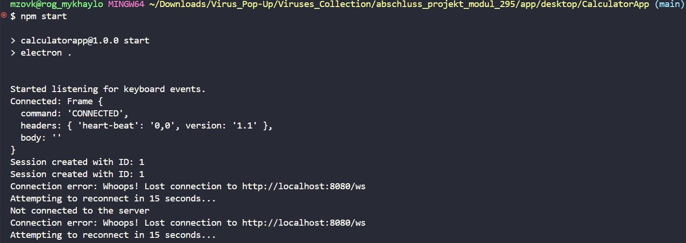

# Dokumentation für das Abschlussprojekt `Calc-Trojan-App`

---
# Inhaltsverzeichnis

1. [Informieren](#informieren)
   - [Überblick](#überblick)
   - [Herausforderungen](#herausforderungen)
   - [Projektidee](#projektidee)
2. [Planen](#planen)
   - [User Stories und Akzeptanzkriterien](#user-stories-und-akzeptanzkriterien)
   - [Arbeitsplan mit Arbeitspaketen und Aufwandsschätzungen](#Arbeitsplan-und-Arbeitspakete-mit-Aufwandsschätzungen)
3. [Entscheiden](#entscheiden)
4. [Realisieren](#realisieren)
   - [Komponenten](#komponenten)
     - [Desktop-Anwendung](#desktop-anwendung)
     - [Server](#server)
     - [Datenbank](#datenbank)
     - [Web-App](#web-app)
   - [Klassendiagramm und Datenmodelle](#klassendiagramm-und-datenmodelle)
   - [API-Dokumentation](#api-dokumentation)
5. [Kontrollieren](#kontrollieren)
   - [Testplan](#Präludium)
6. [Auswerten](#auswerten)
   - [Installationsanleitung](#Auswerten)
   - [Ressourcen](#ressourcen)
   - [Selbstkritische Reflexion](#[Selbstkritische-Reflexion)

---

## Informieren

### Überblick

Dieses Projekt besteht aus drei Hauptkomponenten:
1. Die **Oberfläche** (UI) für die Benutzerinteraktion.
2. Die **Hintergrundlogik**, die Prozesse im Hintergrund steuert und verwaltet.
3. Die **Serverseitige Logik**, die Daten im Frontend darstellt.

---

### Herausforderungen

Im Projekt wurden folgende Fragen und Herausforderungen identifiziert:

- a. Wie kann ich eine Oberfläche für die App erstellen, die die versteckte App ausführt?  
- b. Wie kann ich die versteckte App nach Ende der Taschenrechner-App weiterlaufen lassen?  
- c. Wie muss ich mit dem Betriebssystem umgehen, damit ich unbemerkt bleibe?  
- d. Wie und wie oft müssen die Daten gesendet werden?  
- e. Müssen die Daten gespeichert werden?  
- f. Wie soll der Web-Client die Daten erhalten und wie lange müssen sie gespeichert werden?  
- g. Wie soll die Web-App aussehen, soll sie ein Login haben?

---

### Projektidee

Eine Desktop-Taschenrechner-App, die in Windows und Linux funktioniert, hat nicht das Ziel, Berechnungen durchzuführen, sondern die Daten der Anwender zu sammeln, während und nicht, wenn die App genutzt wird. Die gesammelten Daten werden an eine Datenbank gesendet. Optional kann eine Webseite erstellt werden, die ein Login und eine Verifizierung ermöglicht, um die gesammelten Daten anzuzeigen.

---

## Planen

### Arbeitsplan und Arbeitspakete mit Aufwandsschätzungen

| Datum       | Zeit   | Arbeitspaket         | Erwartete Aufgabe                                | Erledigte Aufgabe                                      |
|-------------|--------|----------------------|--------------------------------------------------|--------------------------------------------------------|
| 29.10.2024                | ca. 4 Std   | Projektinitialisierung                     | Leere Projekte für Frontend und Backend erstellen, MainApp mit Dateispeicherung einrichten | Leere Projekte für Frontend und Backend erstellt, MainApp speichert Daten in `Keys.txt` |
| 30.10.2024  31.10.2024  | ca. 3 Std   | Planung                                    | Aufgaben abschätzen, Theorie wiederholen/vertiefen, UML-Diagramme/Datenmodelle und Struktur planen | Aufgaben grob geschätzt, Struktur in UML-Diagrammen/Datenmodellen festgelegt |
| 01.11.2024                | ca. 6 Std  | WebSocket-Server                           | Spring Boot WebSocket-Server erstellen, grundlegende Verbindung testen | WebSocket-Server erstellt, Verbindung getestet                 |
| 01.11.2024  05.11.2024   | ca. 5 Std | MainApp-Datenversendung umsetzen          | Die MainApp sendet die Daten an den WebSocket-Server reibungslos und die Daten werden in der richtigen Form gespeichert | Die Daten werden alle 15 Minuten mit Filterfunktion und Sendezeit gesendet.              |
| 01.11.2024  02.11.2024   | ca. 2 Std | Datenmodellierung umsetzen                 | Datenmodelle für Benutzer und Sitzungen mit Spring Boot realisieren  | Datenmodelle in Spring entworfen und dokumentiert            |
| 03.11.2024                | ca. 4 Std | Frontend-Verbindung                        | Einfache WebSocket-UI zur Anzeige empfangener Daten                 | Funktionen für eine bessere REST-API hinzugefügt, um den Workflow mit Daten zu verbessern.                             |
| 05.11.2024                | ca. 3 Std | Dokumentation                              | Die Dokumentation fertigstellen und alles auf mögliche Verbesserungen prüfen, sei es technisch oder textlich | Die Doku wurde überarbeitet und alle notwendigen Elemente wurden geprüft und hinzugefügt.                               |

---

### User Stories und Akzeptanzkriterien

#### `User Story 1: Datensammlung während der Nutzung`

**Als** Benutzer der Taschenrechner-App  
**möchte ich**, dass die App meine Rechnungen in Echtzeit kalkuliert,  
**damit** ich Berechnungen durchführen kann.

##### Akzeptanzkriterien:
1. Die App bietet eine benutzerfreundliche Oberfläche, die einfach zu bedienen ist.
2. Die App reagiert schnell auf Benutzereingaben, sodass die Nutzung reibungslos verläuft.
3. Es gibt keine sichtbaren Hinweise auf die Datensammlung, um das Benutzererlebnis nicht zu stören.

---

#### `User Story 2: Anzeige der gesammelten Daten auf einer Webseite`

**Als** Administrator der App  
**möchte ich** eine Webseite haben, die die gesammelten Daten anzeigt,  
**damit** ich die Benutzerinteraktionen analysieren kann.

##### Akzeptanzkriterien:
1. Die Webseite hat Rollen für unterschiedliche Benutzer. Nach der Anmeldung kann der Administrator auf eine Dashboard-Seite zugreifen, die die gesammelten Daten anzeigt.
2. Die gesammelten Daten können nach Session-ID gefiltert werden.
3. Die Webseite muss die Daten in einem klaren, übersichtlichen Format präsentieren, z. B. in Tabellenform oder JSON.
4. Bei der Anzeige der Daten werden alle relevanten Informationen wie Session-ID, Zeitstempel und Eingaben angezeigt.

---

#### `User Story 3: WebSocket-Verbindung zur Datenübertragung`

**Als** Entwickler  
**möchte ich** eine WebSocket-Verbindung implementieren,  
**damit** die gesammelten Daten in Echtzeit an den Server übertragen werden können.

##### Akzeptanzkriterien:
1. Die Trojan-App stellt beim Start eine WebSocket-Verbindung zu einem definierten Server her.
2. Daten werden in einem JSON-Format über die WebSocket-Verbindung gesendet.
3. Der Server empfängt die Daten ohne Verzögerung und speichert sie in der Datenbank.
4. Alle Daten werden persistent gespeichert, sodass sie sicher sind.
5. Die App startet automatisch das Sammeln von Tastatureingaben, sobald sie geöffnet wird. Die App muss in der Lage sein, die Datensammlung auch im Hintergrund fortzusetzen, solange sie ausgeführt wird.

---

## Entscheiden

Die wichtigsten Entscheidungen, die ich während der Programmierung getroffen habe, sind folgende:

- **Desktop-Anwendung**: Ich habe eine Bibliothek verwendet, die einen zuverlässigen Zugriff auf die Tastatur des Clients ermöglicht. Mit Java oder JS allein wäre dies viel komplizierter zu realisieren gewesen. Für den Datentransfer habe ich Methoden von SockJS verwendet.

- **Server**: Für die Server-Kommunikation habe ich mich für eine STOMP-WebSocket-Verbindung entschieden, zusammen mit JPA für die Datenverbindung. Dadurch war es nicht notwendig, separate SQL-Skripte zu schreiben.

- **Web-App**: Für die Web-Anwendung habe ich React eingesetzt, um eine komfortable Benutzererfahrung zu schaffen.


---

## Realisieren

### Komponenten

#### Desktop-Anwendung


Die `CalculatorApp` spielt die Hauptrolle im gesamten Projekt und realisiert die Kernfunktionen.

Ursprünglich wollte ich die App in Java entwickeln, aber aufgrund fehlender Abhängigkeiten für STOMP habe ich mich entschieden, alles mit JavaScript und Electron umzusetzen. Dabei verwende ich die KeyListener-Bibliothek und SockJS, die die Verbindung ermöglichen.


#### Server

Der WebSocket-Server soll eine Vermittlungsrolle zwischen der Desktop-Anwendung und der Web-App spielen und eine effiziente, sofortige Datenübertragung zwischen der Desktop-Anwendung und dem Server ermöglichen. Die Daten sollen dann persistent gespeichert und in der Web-App dargestellt werden.


Innere Struktur:

## 1. `config/`

Dieses Package enthält die Konfigurationsklassen, die den WebSocket-Server einrichten und anpassen. Es legt fest, wie der WebSocket-Server funktioniert und welche Endpunkte verfügbar sind.

- **`WebSocketConfig.java`**:  
  - Richtet die WebSocket-Verbindung ein.
  - Definiert den WebSocket-Endpunkt, über den die Desktop-Anwendung und die Web-App mit dem Server kommunizieren können.
  - Aktiviert und konfiguriert den Nachrichtenbroker, der Nachrichten weiterleitet.
  - **Beispiel**: Die Annotation `@EnableWebSocketMessageBroker` signalisiert Spring Boot, dass WebSocket-Nachrichten unterstützt werden.

## 2. `controller/`

Das `controller` Package beinhaltet die "Controller"-Klassen, die Nachrichten von Clients empfangen und verarbeiten.

- **`WebSocketController.java`**:  
  - Nimmt eingehende Nachrichten entgegen und entscheidet, wie sie weitergeleitet werden.
  - Verwendet `@MessageMapping`, um bestimmte Methoden auf definierte Nachrichtenkanäle reagieren zu lassen.
  - **Beispiel**: Eine Methode in dieser Klasse könnte eine eingehende Nachricht empfangen und an alle verbundenen Clients weiterleiten.

// **not implemented**
## 3. `handler/`

Hier liegen die benutzerdefinierten Handler-Klassen, die spezielle Logik für die Verarbeitung von Nachrichten implementieren.

- **`CustomWebSocketHandler.java`**:  
  - Reagiert auf eingehende Nachrichten und ermöglicht individuelle Verarbeitung.
  - Enthält Logik, um Nachrichten zu speichern oder zu verändern, bevor sie weitergeleitet werden.
  - **Beispiel**: Die Klasse könnte Nachrichten filtern oder validieren, bevor sie anderen Clients zur Verfügung gestellt werden.

// **not implemented**
## 4. `listener/`

Dieses Package enthält Klassen, die auf spezifische Ereignisse wie Tastenkombinationen reagieren.

- **`KeyEventListener.java`**:  
  - Dieser Listener reagiert auf definierte Tastenkombinationen (z. B. `Enter + C`) und führt eine Aktion aus, wie das Verschieben des Eingabefokus auf ein bestimmtes Datenfeld.
  - **Beispiel**: Wenn die Tastenkombination `Enter + C` gedrückt wird, wird die Nachricht in das Feld für `action` und nicht in `text` gespeichert.

## 5. `model/`

Das `model` Package definiert die Datenstrukturen, die im gesamten Server verwendet werden.

- **`Message.java`**:  
  - Repräsentiert eine Nachricht mit Feldern wie `content` (Nachrichtentext) und `sender` (Absender).
  - Dieses Modell hilft dabei, die Struktur und die benötigten Felder jeder Nachricht zu definieren.
  - **Beispiel**: Beim Senden einer Nachricht wird ein `Message`-Objekt erstellt und weiterverarbeitet.

## 6. `repository/`

Das `repository` Package enthält Klassen, die sich um die Interaktion mit der Datenbank kümmern und Daten persistent speichern.

- **`MessageRepository.java`**:  
  - Bietet Methoden, um Nachrichten in einer Datenbank zu speichern, zu lesen und zu löschen.
  - Durch die Verwendung eines `Repository`-Interfaces, z. B. mit Spring Data JPA, können Nachrichten dauerhaft gespeichert und bei Bedarf abgerufen werden.
  - **Beispiel**: `save()`-Methoden zum Speichern von Nachrichten oder `findAll()`-Methoden zum Abrufen aller Nachrichten für die Web-App.

## 7. `service/`

Das `service` Package enthält die Geschäftslogik der Anwendung. Hier werden eingehende Daten verarbeitet, bevor sie weitergeleitet werden.

- **`MessageService.java`**:  
  - Beinhaltet Methoden zur Verwaltung und Verarbeitung von Nachrichten, z. B. zur Überprüfung oder Modifikation vor der Weiterleitung.
  - Kann zur Validierung oder Anpassung von Nachrichten verwendet werden.
  - **Beispiel**: Die `MessageService`-Klasse kann eine Nachricht formatieren oder filtern, bevor sie an den Controller weitergegeben und an die Clients verteilt wird.

---

#### Datenbank

Die gesamte Struktur der Datenbank ist relativ einfach und besteht aus drei Komponenten: `User`, `Session` und `Keystroke`. Diese ermöglichen eine effiziente Datenspeicherung.


#### Web-App

Das Frontend besteht aus drei Hauptkomponenten, jedoch keiner zentralen `App.jsx`. Diese Komponenten sind `Dashboard.jsx`, `KeystrokeList.jsx` und `SessionList.jsx`. Die Daten werden mithilfe von Axios abgerufen.

Es gibt eine Benutzerliste, aus der der Benutzer einen User auswählen kann. Wird ein Benutzer ausgewählt, wird er zur `SessionList` weitergeleitet, in der die Datensätze für jede Sitzung gespeichert und angezeigt werden.

Der Benutzer kann eine Sitzung löschen, Datensätze bearbeiten oder löschen und auch neue Benutzer erstellen, löschen, bearbeiten oder als Liste abrufen. Im Frontend ist allerdings nicht alles von dieser Funktionalität umgesetzt worden.


---

### Klassendiagramm und Datenmodelle


---

### API-Dokumentation

Die vollständige Dokumentation ist unter diesem Link verfügbar: [http://localhost:8080/swagger-ui/index.html](http://localhost:8080/swagger-ui/index.html).

#### Ein paar Punkte zur REST API-Implementierung:

1. Die REST API besteht aus zwei Teilen: Der erste Teil ist für die Frontend-Entwicklung gedacht und beginnt mit `api/...`. Der zweite Teil ist für die interne Kommunikation der Server entwickelt worden; diese Teile sind automatisiert und müssen im Frontend nicht eingesetzt oder verwendet werden.
2. Das Backend ermöglicht alles, sei es: Laden von Daten, Erfassen von Daten, Editieren von Daten oder Löschen von Daten.


---

## Kontrollieren

### Testplan und manuelle Test inklusive Testprotokoll 

#### Präludium
Dieses manuelle Test & Testprotokoll dokumentiert die Ergebnisse der positiven und negativen Tests des Projkets. Die Tests decken alle wesentlichen Funktionen des Projekts und seiner Module ab.

#### Manuelle Test inklusive Testprotokol
**Datum:** 04.11.2024  
**Tester:** Mykhaylo Zhovkevych

| Testfall-ID | Testfallbeschreibung                                          | Eingabedaten                            | Erwartetes Ergebnis                                           | Tatsächliches Ergebnis                                                                                                                                            | Status     |
|-------------|---------------------------------------------------------------|-----------------------------------------|----------------------------------------------------------------|-------------------------------------------------------------------------------------------------------------------------------------------------------------------|------------|
| TC-001      | Positiver Test: Datensammlung während der Nutzung             | Benutzer nutzt die Taschenrechner-App   | Die App erfasst und speichert die Tastatureingaben            | Die App registriert alle Eingaben korrekt, sendet die Daten und speichert sie als Textdatei im App-Verzeichnis.                                                   | Erledigt   |
| TC-002      | Positiver Test: Anzeige der gesammelten Daten auf der Webseite | Administrator nutzt die Webseite        | Die Webseite zeigt die gesammelten Daten korrekt an           | Die Webseite zeigt alle verfügbaren Daten an, die der Server von den Clients erhält.                                                                               | Erledigt   |
| TC-003      | Positiver Test: WebSocket-Verbindung zur Datenübertragung     | Anwendung startet                       | Die WebSocket-Verbindung wird erfolgreich hergestellt          | Der Server baut eine STOMP-Verbindung fehlerfrei mit verschiedenen Clients auf.                                                                                   | Erledigt   |
| TC-004      | Negativer Test: Benutzerinteraktion ohne Internetverbindung   | Internetverbindung unterbrochen         | Die App zeigt eine Fehlermeldung an und speichert die Daten lokal | Die App zeigt im Terminal eine Meldung über die unterbrochene Internetverbindung und versucht, die Verbindung nach 15 Sekunden wiederherzustellen. Daten werden lokal in einer Datei gespeichert. | Erledigt   |
| TC-005      | Negativer Test: Falsche Berechnung bei Rechenoperation      | Benutzer berechnet `0 / 0` | Die App zeigt eine Fehlermeldung „error“ oder ähnliches | Die App zeigt eine Fehlermeldung, sodass Benutzer weiss | Erledigt  |
| TC-006      | Negativer Test: Fehlgeschlagene WebSocket/API-Verbindung      | Server nicht erreichbar                 | Die Anwendung zeigt eine Fehlermeldung über die Verbindungsprobleme | Eine Meldung über Verbindungsprobleme wird angezeigt, sowohl im Frontend, dass kein Benutzer gefunden wurde, als auch in der Desktop-App oder im Backend-Terminal. | Erledigt   |

#### Testfälle mit curl-Skripten

| Test-ID | Befehlen                                                    | Ergebnis          |
|---------|----------------------------------------------------------|-------------------|
| TC-001  |                                    |      Alles funktioniert       |
| TC-002  | `curl -X 'GET' \ 'http://localhost:8080/api/keystrokes' \ -H 'accept: */*'`  |  200 Alles funktioniert                 |
| TC-003  | N/A die Verbindung wird immer mit unterschiedlich token erstellt, zu gehen: http://localhost:8080/ dort Js verbindet mit server immer     |  101 Alles funktioniert                 |
| TC-004  |  |  Alles funktioniert                 |
| TC-005  | die App öffnen 0 /0 ergibt NaN ` |    Alles funktioniert               |
| TC-006  |      | Alles funktioniert                  |


### JUnit-Tests 

In der JUnit Test wurden die `/api/..` Endpoins getestet und noch ein paar Szenario mit Mockup gemacht. 

Die Klasse KeystrokeControllerRestTest testet die beiden Methoden GET und PUT. Bei GET sollen die Daten abgerufen werden, und bei PUT sollen die Daten aktualisiert werden. Der Server bearbeitet die Anfragen richtig, da im Frontend alles funktioniert. Allerdings kann ich den JUnit-Test nicht richtig ausführen.

---

## Auswerten

### Installationsanleitung für Desktop App & Backend Frontend

#### 1. Desktop App

##### 1.1. Repository klonen
Ziehen Sie das Repository in Ihr lokales Verzeichnis.

##### 1.2. Node.js installieren
Installieren Sie die neueste Version von Node.js, idealerweise Version 20 oder höher.

##### 1.3. Navigieren Sie zum richtigen Ordner
Öffnen Sie das Terminal und navigieren Sie zu dem Ordner, in dem sich die Desktop-App befindet.

##### 1.4 Abhängigkeiten installieren => npm install electron fs path node-global-key-listener sockjs-client stompjs

##### 1.5. package.json konfigurieren => npm init -y
```bash
{
  "name": "calculatorapp",
  "version": "1.0.0",
  "main": "main.js",
  "scripts": {
    "start": "electron ."
  },
  "dependencies": {
    "electron": "^VERSION",
    "fs": "^VERSION",
    "path": "^VERSION",
    "node-global-key-listener": "^VERSION",
    "sockjs-client": "^VERSION",
    "stompjs": "^VERSION"
  }
}
```

##### 1.6. App starten => npm start

#### 2. Backend-Installation

##### 2.1. Java installieren
Überprüfen Sie, ob Java Version 17 oder höher installiert ist:
```bash
   java -version
```
##### 2.2. Projekt aus dem Repository klonen
Klonen Sie das Projekt von Ihrem Git-Repository:
```bash
git clone <Repository-URL>
```
Navigieren Sie anschliessend in das Backend-Verzeichnis:
```bash
cd <Projektverzeichnis>/backend
```

##### 2.3. MySQl User, Datenbank und `application.properties`
Benutzer mit allen Berechtigungen erstellen und die Konfigurationsdatei so konfigurieren, dass das Backend die Daten dauerhaft speichern kann.
```bash
spring.datasource.url=jdbc:mysql://localhost:3306/<datenbankname>
spring.datasource.username=<benutzername>
spring.datasource.password=<passwort>
spring.jpa.hibernate.ddl-auto=update
spring.jpa.show-sql=true
```

##### 2.4. Abhängigkeiten herunterladen und Backend starten
Überprüfen Sie, ob Maven installiert ist:
```bash
mvn -version
```
Laden Sie die Abhängigkeiten herunter und starten Sie das Backend mit folgendem Befehl:
```bash
mvn spring-boot:run
```

##### 2.5. Backend ohne Frontend oder Desktop-App verwenden
Das Backend ist so konfiguriert, dass es unabhängig von einer Frontend- oder Desktop-App getestet werden kann. Öffnen Sie einfach Ihren Webbrowser und gehen Sie zu: http://localhost:8080


#### 3. Fronted

##### 3.1. Repository klonen
Klonen Sie das Repository für das Frontend in Ihr lokales Verzeichnis:
```bash
git clone <Repository-URL>
```
Navigieren Sie anschliessend in das Frontend-Verzeichnis:
```bash
cd <Projektverzeichnis>/frontend
```

##### 3.2. Abhängigkeiten installieren
Die Anhändigkeiten sind schon in `package.json` drin.
```bash
npm install
```

##### 3.3. Vite konfigurieren
Stellen Sie sicher, dass Ihre Vite-Konfiguration korrekt ist. Diese sollte in einer Datei namens vite.config.js liegen. Hier ist ein Beispiel:

```javascript
import { defineConfig } from 'vite';
import react from '@vitejs/plugin-react';

export default defineConfig({
  plugins: [react()],
  server: {
    proxy: {
      '/api': {
        target: 'http://localhost:8080',
        changeOrigin: true,
        secure: false,
      },
    },
  },
});
```

##### 3.4. Frontend starten

Starten Sie das Frontend mit dem folgenden Befehl:

``` bash
npm run dev
```

---

### Ressourcen

1. **Entwicklungsumgebungen**
   - Visual Studio Code

2. **Datenbanken**
   - MySQL

3. **Frameworks**
   - React
   - Spring Boot 

4. **Testtools**
   - Jest
   - JUnit 5

5. **Build-Tools**
   - Vite
   - Maven

6. **Programmiersprache**
   - Java
   - JavaScript

7. **API-Management**
   - Postman 

8. **HTTP-Client**
    - Axios
    - Fetch API
  

### Selbstkritische Reflexion

Zum Schluss des Projekts habe ich viele neue Erfahrungen mit Spring allgemein gemacht. Das Ergebnis, das ich am Ende erhalten habe, ist sehr positiv, da alle Ziele, die ich mir gesetzt habe, erreicht wurden. Die Desktop-App funktioniert reibungslos und verarbeitet die Daten wie gedacht. Der Server ist vielseitig und arbeitet mit dem Messagebroker sowie mit einer kleinen REST-API für das Frontend.

Ich habe nicht viel Zeit in das Frontend investiert, aber die grundlegende Funktionalität ist vorhanden. Leider konnte ich nicht alles rechtzeitig erledigen, insbesondere die JUnit-Tests. Dafür habe ich nicht genug Zeit eingeplant, um sie gründlich durchzuführen. Alles andere habe ich jedoch sauber umgesetzt. Natürlich gibt es mehrere Punkte in der Architektur des Servers, die ich möglicherweise besser hätte lösen können, zum Beispiel könnte ich WebSocket von der REST-API abtrennen. Aber solange alles funktioniert, bin ich zufrieden.

Es gibt ein paar kleine Teile im Server-Code, die nicht ganz implementiert sind, z.B. das Vergessen, die end_time der Session zu senden, bevor sie abbricht. Das ist jedoch machbar. Vielleicht können nach dem Code-Review zusätzliche Probleme aufgedeckt werden. Bis jetzt ist das die grösste Herausforderung, die ich am 05.11.2024 bemerkt habe. Ansonsten fand ich das Modul cool und es ist ein guter Start, um mich weiter in das Thema zu vertiefen und neue Theorien zu lernen. Am Ende habe ich ein positives Gefühl über das Modul sowie über das Abschlussprojekt.

---
